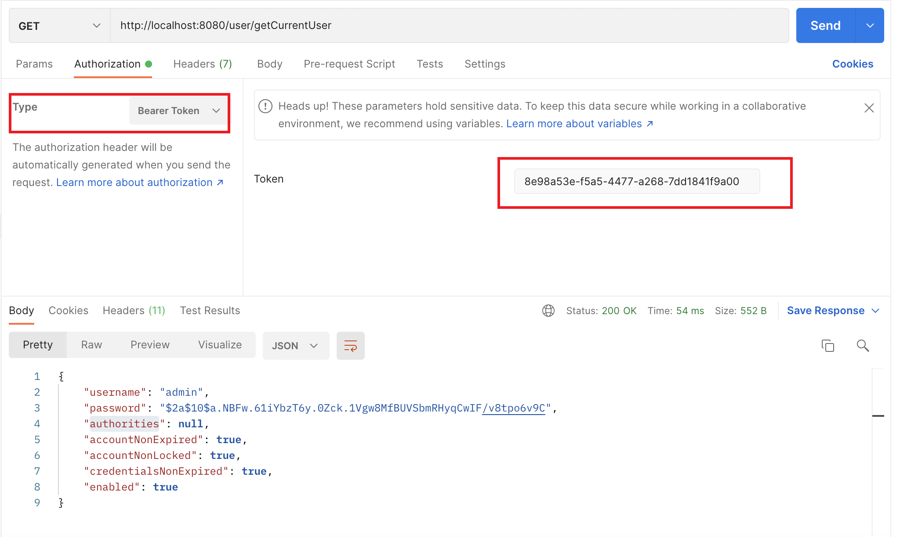

# Spring Security Oauth2 授权码模式demo

## 一、引入依赖
```xml
<dependency>
    <groupId>org.springframework.cloud</groupId>
    <artifactId>spring-cloud-starter-oauth2</artifactId>
</dependency>
<dependency>
    <groupId>org.springframework.cloud</groupId>
    <artifactId>spring-cloud-starter-security</artifactId>
</dependency>
```
## 二、配置
### 2.1 安全配置
> 参考类SecurityConfig.java

### 2.2 授权服务器配置
> 参考类 AuthorizationServerConfig.java

### 2.3 资源服务器配置
> 参考类 ResourceServerConfig.java

## 三、测试

## 3.1、授权码模式测试：
### 3.1.1、浏览器中发送以下请求   
http://localhost:8080/oauth/authorize?response_type=code&client_id=admin&redirect_uri=http://www.baidu.com&scope=all

登录成功后将会跳转到 http://www.baidu.com,并且后面会有code


### 3.1.2、发送post请求获取token
http://localhost:8080/oauth/token
> 选择 Basic Auth 传入客户端的id和密码  
> 其他参数也要注意和授权服务器里配置的保持一致


### 3.1.3、携带token去访问资源
> 用第二步获得的token去访问相应资源



到此授权码模式结束

## 3.2、密码模式测试：

### 3.2.1、发送post请求获取token
http://localhost:8080/oauth/token
> 选择 Basic Auth 传入客户端的id和密码  
> 其他参数也要注意和授权服务器里配置的保持一致


### 3.2.2、携带token去访问资源
> 用第二步获得的token去访问相应资源


到此密码模式结束